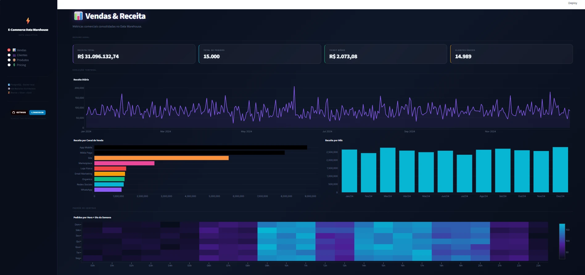

<div align="center">

# 🛒 E-Commerce Data Warehouse

### Pipeline completa de Analytics Engineering — do dado bruto ao dashboard analítico

[](https://python.org)
[](https://getdbt.com)
[](https://streamlit.io)
[](https://postgresql.org)
[](https://docker.com)
[](https://plotly.com)

</div>

---



---

## O que é este projeto?

Um **Data Warehouse de e-commerce construído de ponta a ponta**, implementando as melhores práticas de Analytics Engineering com dados ingeridos em camada raw e sendo projetado para nível profissional em ambiente de prod e dev.

Este projeto implementa uma **Plataforma de Dados** completa que simula o ecossistema de dados de uma grande operação de comércio eletrônico. Ele utiliza a **moderna Arquitetura Medallion (Bronze, Prata, Ouro)** modelada e mantida em um banco de dados PostgreSQL em nuvem .`dbt`

O fluxo de trabalho de dados culmina em um *Dashboard Analítico* oriundo de **4 Data Marts (Vendas, Clientes, Pricing, Produto)** de maneira interativa e premium construído com o Streamlit, permitindo decisões baseadas em dados para a gestão de C nível.

Este projeto demonstra práticas reais de modelagem de dados, engenharia analítica e inteligência de negócios.


## 📋 Overview da orquestração 

| Dado | Volume |
|------|--------|
| Clientes | 500 |
| Produtos | 80 |
| Vendas geradas | 15.000 |
| Registros no banco | 18.727 |
| Receita total simulada | R$ 31.096.132,74 |
| Modelos dbt | 12 (4 Bronze + 4 Silver + 4 Gold) |


## 🎯 Objetico do Projeto


O principal objetivo deste projeto é mostrar:

- Implementação da Arquitetura Medallion
- Engenharia de Análise com DBT (Ferramenta de Construção de Dados)
- Integração moderna de banco de dados em nuvem (Supabase)
- Regras de negócio complexas (Segmentação de Clientes, Elasticidade de Preços)
- Design avançado de dashboards de UI/UX (Glassmorphism)
- Gerenciamento de configuração orientado a produção

---

## Arquitetura Medallion

> 📊 [Ver diagrama interativo completo](<docs/Arquitetura - Standalone.html>)

```
┌─────────────────────────────────────────────────────┐
│                   FONTES DE DADOS                   │
│         scripts.raw ·  ingestion init ·  raw_data   │
└──────────────────────────┬──────────────────────────┘
                           │
                     load_raw.py
                           │
          ┌────────────────▼────────────────┐
          │           RAW SCHEMA            │
          │  vendas · clientes · produtos   │
          │       preco_competidores        │
          └────────────────┬────────────────┘
                           │  dbt run
          ┌────────────────▼────────────────┐
          │         BRONZE  (views)         │  ← réplica fiel, auditoria
          └────────────────┬────────────────┘
                           │  dbt run
          ┌────────────────▼────────────────┐
          │         SILVER  (views)         │  ← limpeza · tipagem · tempo
          └────────────────┬────────────────┘
                           │  dbt run
          ┌────────────────▼────────────────┐
          │          GOLD  (tables)         │
          │                                 │
          │  gold_kpis_vendas    (10 cols)  │ ← regras de negócio · 4 Data Marts
          │  gold_customer_360    (9 cols)  │
          │  gold_kpis_produtos  (15 cols)  │
          │  gold_kpis_pricing   (12 cols)  │
          └────────────────┬────────────────┘
                           │
          ┌────────────────▼────────────────┐
          │    DASHBOARD STREAMLIT (4 pgs)  │
          └─────────────────────────────────┘
```

### Regra das camadas

| Camada | Faz | Nunca faz |
|--------|-----|-----------|
| **Bronze** | Copia o dado da fonte | Transforma, filtra, calcula |
| **Silver** | Limpa, tipifica, cria dimensões temporais | Agrega |
| **Gold** | Agrega, aplica regras de negócio | Cast de tipos |

### Refino
- **Bronze (Raw/Bruto):** Replicação direta 1:1 das tabelas operacionais de e-commerce (`vendas`, `clientes`,`produtos`,`preco_competidores`)
- **Prata (Limpeza):** Sanitização de dados, type casting, e padronizações (ex: formatação de data) sem filtragem pesada ou joins.
- **Ouro (Negócios/Data Marts):** Agregações complexas, lógicas de ranqueamento - ranking logic e regras de negócios projetadas para consumo direto (Vendas, Sucesso do Cliente, Produtos e Preços).
- **Apresentação (Dashboard):** Otimizar e tornar visual a leitura de aplicações diretamente da camada Gold para fornecer análises em tempo real.
---

## Dashboard — 4 Data Marts

<table>
<tr>
<td width="50%">

**📊 Vendas & Receita**
- Receita total · Ticket médio · Pedidos
- Série temporal diária (Jan–Dez 2024)
- Receita por canal de venda
- Heatmap de pico por hora × dia

</td>
<td width="50%">

**👥 Customer 360**
- Segmentação VIP / Top Tier / Regular
- Ranking top 10 clientes por receita
- Distribuição geográfica por estado
- Tabela com filtro por segmento

</td>
</tr>
<tr>
<td width="50%">

**📦 Produtos**
- Top 15 por receita com status de tendência
- Treemap de receita por categoria
- Produtos em queda nos últimos 3 meses
- Status: Estável vs Queda de Vendas

</td>
<td width="50%">

**💲 Pricing & Competitividade**
- Posicionamento vs concorrentes
- Diferença % vs média por categoria
- Scatter: nosso preço × média mercado
- Alerta de produtos fora da faixa

</td>
</tr>
</table>

---

## Tech Stack

| Layer | Technology |
|-------|------------|
| Language | Python |
| Data Modeling | dbt (Data Build Tool) |
| Database | PostgreSQL (Supabase/DBeaver - Futuro) |
| Data Processing | Pandas |
| Dashboard UI | Streamlit |
| Infraestrutura |  Docker Compose |
| Data Visualization | Plotly Express |


---

## Estrutura

```
datawarehouse-ecom/
│
├── data/
│   ├── raw/                          # CSVs + Parquets gerados
│   └── scripts/raw.py                
│
├── ingestion/
│   ├── init.schema.sql               # Schemas RAW + Gold no PostgreSQL
│   └── load_raw.py                   # CSV → schema raw.*
│
├── dbt/ecommerce/
│   ├── dbt_project.yml               # Config: Bronze=view, Gold=table
│   ├── profiles.yml                  # dev (Docker :5433) + prod 
│   └── models/
│       ├── _sourcers.yml             # Fontes RAW declaradas
│       ├── bronze/                   # 4 views (réplica fiel)
│       ├── silver/                   # 4 views (limpeza + tipagem)
│       └── gold/
│           ├── sales/                # gold_kpis_vendas
│           ├── customer_success/     # gold_customer_360
│           ├── pricing/              # gold_kpis_pricing
│           └── product/              # gold_kpis_produtos
│
├── dashboard/
│   ├── app.py                        # 4 páginas · Dark Glassmorphism
│   └── requirements.txt
│
├── docs/
│   ├── Arquitetura - Standalone.html # Diagrama interativo
│   ├── ficha-tecnica-dbt.md
│   ├── ambiente.md
│   └── MVP3.md
│
├── .env.example
├── docker-compose.yml
└── requirements.txt
└── README.md                         # Documentação técnica
```

---

## Rodando localmente

```bash
# 1. Clone
git clone https://github.com/ElendeBona/datawarehouse-ecommerce.git
cd datawarehouse-ecommerce

# 2. Variáveis de ambiente
cp .env.example .env

# 3. Banco de dados
docker compose up -d

# 4. Dados sintéticos → PostgreSQL
python data/scripts/raw_data.py
python ingestion/load_raw.py

# 5. Transformações dbt
cd dbt/ecommerce
dbt run       # Bronze → Silver → Gold
dbt test      # validação de qualidade

# 6. Dashboard
cd ../..
streamlit run dashboard/app.py
# http://localhost:8501
```

---

## Ambientes

| | dev | prod |
|-|-----|------|
| **Banco** | PostgreSQL Docker (localhost:5433) | Supabase (cloud) |
| **Comando dbt** | `dbt run` | `dbt run --target prod` |
| **Credenciais** | `.env` local | variáveis de ambiente |

---

## Roadmap

```
✅ MVP1 — Pipeline base
         geração de dados · ingestão · dbt Medallion · dashboard Streamlit

⬜ MVP2 — Copiloto IA
         linguagem natural → SQL · MCP + Claude · análise conversacional

⬜ MVP3 — Orquestração
         Apache Airflow · campanhas de marketing · custos de produtos · CAC · ROI
```

---

## 📞 Contact

<div align="center">

[](https://github.com/ElendeBona)
[](https://www.linkedin.com/in/elenjohann/)

`Analytics Engineering · dbt · Streamlit · PostgreSQL · Python`

</div>
# datawarehouse-ecommerce

